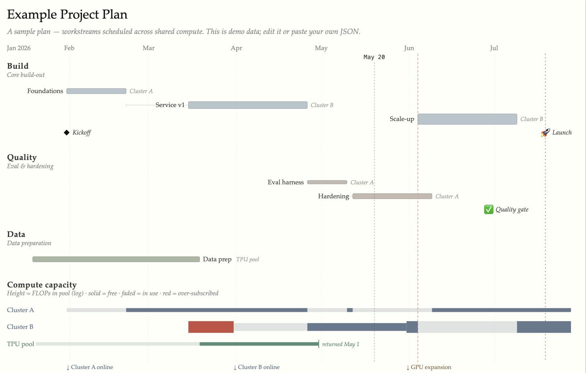

# plantt - a beautiful planning Gantt backbone for large AI projects, LLM-driveable and front-end only

Making sure that compute capacity is appropriately used and that ambitious AI projects aren't blocked by preventable delays isn't easy, and planning tools are woefully hard to manipulate, read, and keep up to date (and ugly). Plantt addresses all of these with a lightweight LLM-driveable (via a skill) Gantt chart generator and editor. Easily share plans with collaborators, who can make their own changes and share them back with just a URL. Front-end only, to make both privacy and sharing natural.

**Live:** http://openathena.ai/plantt/




## Features meant to make coordinating large model development plans easy and automatable

### Lightweight, shareable, agent-driveable
- Agent-remote controllable via a local LLM relay, so larger text plans can be automatically translated into JSON plans, and edits can be made easily.
- Direct-manipulation in-UI editing — drag to move/resize, snap, wire dependencies, double-click to edit via modal.
- Embedded JSON editor as the source of truth, with live validation.
- Plans shareable via compressed URLs.
- Undo/redo history tree (branches preserved), named plans.
- Themeable (Tufte, Solarized, LaTeX, Catppuccin, Nord, Gruvbox, Dracula, Rosé Pine, Print, …), following the OS light/dark preference. Themes are local-only and importable/exportable as JSON.

### Model planning-focused
- Compute-capacity lanes: per-cluster utilization, FLOPs-scaled lane heights, over-subscription. Activities can rely on clusters, and overutilization is flagged.
- Dependency connection with a violations highlighted.


## Develop

```bash
npm install
npm run dev      # http://localhost:5173
npm run build    # → dist/  (deployed to GitHub Pages by .github/workflows/deploy.yml)
```

The app is plain ES modules bundled by Vite for hot reload; `src/main.js` is the whole app.


## Remote control (optional)

Loading the app with `?agent=1` lets a local tool drive the active plan over a small
localhost relay — see [`.claude/skills/plantt-remote`](.claude/skills/plantt-remote).
It exposes a `window.plantt` API (`describe`, `getState`, `outline`, `getDeps`, `getDependents`,
`setModel`, an atomic name-addressed `apply(ops)`, and a `themes` namespace); a normal visit
(without `?agent=1`) exposes nothing reachable.
