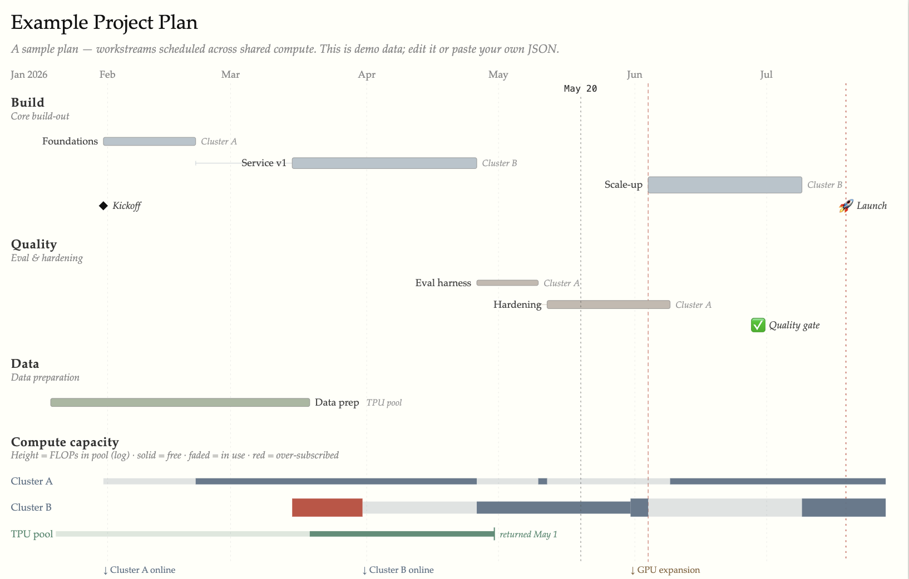

# plantt - a beautiful planning Gantt backbone for large AI projects, LLM-driveable and front-end only

Making sure that compute capacity is appropriately used and that ambitious AI projects aren't blocked by preventable delays isn't easy, and planning tools are woefully hard to manipulate, read, and keep up to date (and ugly). Plantt addresses all of these with a lightweight LLM-driveable (via a skill) Gantt chart generator and editor. Easily share plans with collaborators, who can make their own changes and share them back with just a URL. Front-end only, to make both privacy and sharing natural.

**Live:** https://plantt.oa.dev/ (the old address, openathena.ai/plantt, redirects and offers to move your locally saved plans)




## Features meant to make coordinating large model development plans easy and automatable

### Lightweight, shareable, agent-driveable
- Agent-remote controllable via a local LLM relay, so larger text plans can be automatically translated into JSON plans, and edits can be made easily.
- Direct-manipulation in-UI editing — drag to move/resize, snap, wire dependencies, double-click to edit via modal.
- Embedded JSON editor as the source of truth, with live validation.
- Plans shareable via compressed URLs.
- Undo/redo history tree (branches preserved), named plans.
- Themeable (Tufte, Solarized, LaTeX, Catppuccin, Nord, Gruvbox, Dracula, Rosé Pine, Print, …), following the OS light/dark preference. Themes are local-only and importable/exportable as JSON.

### Model planning-focused
- Compute-capacity lanes: per-cluster utilization, FLOPs-scaled lane heights, over-subscription. Activities can rely on clusters, and overutilization is flagged.
- Dependency connection with a violations highlighted.


## Accounts, sharing, forking (optional)

Signed out, plantt is exactly the front-end-only app described above: plans live in your browser
and travel as URLs. Signed in (GitHub, Open Athena members or an allowlist), every plan syncs to
the server, and you get a plan index, sharing (private / org / anyone with the link; view or
edit), forking (a deep copy that keeps the whole undo tree), archive/delete, and an audit log.
Two people editing one plan produce two branches under a common parent, never a lost edit.
Design notes: [`docs/multiuser-plan.md`](docs/multiuser-plan.md).

## Develop

```bash
npm install
npm run dev      # http://localhost:5173 — front end (Vite, hot reload)
npm run dev:api  # http://127.0.0.1:8788 — Pages Functions + local D1 (Vite proxies /api and /auth here)
npm run db:local # apply migrations to the local D1
npm run build    # → dist/  (deployed to Cloudflare Pages by .github/workflows/cloudflare.yml)
```

The app is plain ES modules bundled by Vite for hot reload; `src/main.js` is the whole front end,
`src/ops.js` the shared plan ops, `functions/` the API (Cloudflare Pages Functions + D1). Sign-in
locally needs a `.dev.vars` (gitignored) with `SESSION_SECRET`, `GITHUB_CLIENT_ID`,
`GITHUB_CLIENT_SECRET` and `PUBLIC_ORIGIN=http://localhost:5173`.


## Remote control (optional)

Loading the app with `?agent=1` lets a local tool drive the active plan over a small
localhost relay — see [`.claude/skills/plantt-remote`](.claude/skills/plantt-remote).
It exposes a `window.plantt` API (`describe`, `getState`, `outline`, `getDeps`, `getDependents`,
`setModel`, an atomic name-addressed `apply(ops)`, and a `themes` namespace); a normal visit
(without `?agent=1`) exposes nothing reachable.

### Installing the skill

The skill is one self-contained folder — [`.claude/skills/plantt-remote/`](.claude/skills/plantt-remote)
— holding `SKILL.md` (the instructions) and `relay.mjs` (the localhost bridge). It has **no build
step and no runtime dependency on this repo**: it drives a running plantt tab and pulls the live
schema from the app itself (`GET /schema`). It needs only Node.js (to run the relay) and `curl`.

**Claude Code / any agent that reads `~/.claude/skills/`:**
- *Working inside this repo* — nothing to do. Project skills under `.claude/skills/` are
  auto-discovered whenever the working directory is in the plantt checkout.
- *Globally (every project)* — symlink it into your user skills dir so it stays in lockstep with
  the repo copy:
  ```bash
  ln -s "$PWD/.claude/skills/plantt-remote" ~/.claude/skills/plantt-remote
  ```
  Use `cp -R` instead for a detached copy — but a copy won't track schema/op changes, and this
  skill's value is staying in sync with `src/schema.js`, so prefer the symlink.

**Any other shell-capable LLM agent** (no `~/.claude/skills` convention): `SKILL.md` is plain
Markdown — load or paste its contents into the agent's context as instructions. That's the entire
interface; the agent then runs `node relay.mjs` and drives it with `curl` exactly as the file
describes. (Portable toolkits can also vendor the folder and copy it into `~/.claude/skills/` on
setup.)
